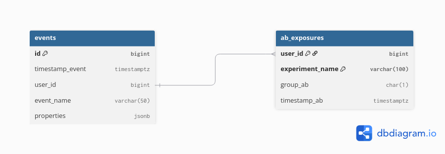

# Cohorta
## Описание
Cohorta - это учебно-демонстрационный проект для портфолио полного цикла по продуктовой аналитике. Проект охватывает полный цикл создания аналитического продукта: от проектирования базы данных и генерации синтетических данных до создания дашбордов в BI-инструменте и работы с Docker. Проект решает задачи когортного анализа, проведения A/B-тестирования, рассчёта LTV(накоплнной выручки на пользователя) и создания интерактивных дашбордов.

## Стек
- PostgreSQL
- Python
- Apache Superset
- Docker

## Архитектура данных
### Схема данных

### Описание данных

#### events

| Поле | Тип | Описание |
|------|-----|----------|
| `id` | `BIGINT` | Первичный ключ, автоинкремент |
| `timestamp_event` | `TIMESTAMPTZ` | Время события с часовым поясом |
| `user_id` | `BIGINT` | Идентификатор пользователя |
| `anonymous_id` | `VARCHAR(100)` | Идентификатор анонимного пользователя |
| `event_name` | `VARCHAR(50)` | Тип события |
| `device_type` | `VARCHAR(50)` | Тип устройства |
| `traffic_source` | `VARCHAR(50)` | Источник трафика |
| `properties` | `JSONB` | Свойства (дополнительные данные) |

#### ab_exposures

| Поле | Тип | Описание |
|------|-----|----------|
| `user_id` | `BIGINT` | Идентификатор пользователя |
| `timestamp_ab` | `TIMESTAMPTZ` | Время A/B-теста с часовым поясом |
| `experiment_name` | `VARCHAR(100)` | Название теста |
| `group_ab` | `VARCHAR(1)` | Группа |

Для ускорения запросов созданы индексы:
> - (event_name, timestamp_event) — для быстрых фильтров по событиям и времени.
> - (user_id) — для соединений с ab_exposures.
> - GIN-индекс на properties — для быстрого поиска внутри JSONB.

### Пример события (JSON)
```json
{
  "timestamp_event": "2026-07-01T20:15:00Z",
  "user_id": 12345,
  "event_name": "purchase",
  "properties": {"revenue": 2500, "category": "electronics"}
}
```

### Поток событий
> Данные генерируются скриптом generate_data.py, который создаёт события и распределяет пользователей по группам A/B. Данные загружаются в PostgreSQL. Затем SQL-запросы формируют витрины для когортного анализа, LTV и A/B-тестирования. Витрины визуализируются в Apache Superset.
